> Want to know what I'm currently working on ?
> Checkout [Lightning-Lite](https://github.com/Athleity/lightning-lite-quantum-simulator)
>
> *PS: BS Physics (Quantum Technologies) at IIT Jodhpur. I run algorithms on real quantum hardware and chase the noise instead of averaging it away.*
>
> - [x] **Power Grid QAOA** — QUBO on Rigetti Ankaa-3, Q-volution 2026 Best Overall
> - [x] **IBM 156-qubit pipeline** — daily automated T1/T2, gate and readout characterization
> - [x] **Nuclear astrophysics** — S-factor analysis for five α,n reactions
> - [ ] **Lightning-Lite** — C++20 quantum simulator, validated against Qiskit Aer
> * → I'm working actively on this currently (updated Oct 2026)
>
> *Thanks for stopping by !*

  
  

These infographics were generated using a small script and [lowlighter/metrics](https://github.com/lowlighter/metrics)

[LinkedIn](https://linkedin.com/in/priyansh-bhavsar-2b4b95260) · [Email](mailto:b22ph005@alumni.iitj.ac.in)
